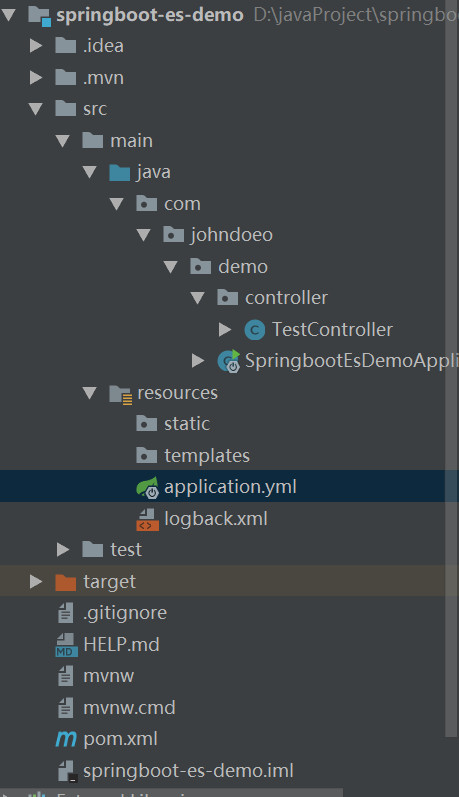

@[TOC](springboot+elasticsearch+mybatis+mysql初探)

参考文章：[spring boot2 + mybatis + elasticsearch + mysql 整合（1）——项目搭建与测试](https://blog.csdn.net/m0_38084243/article/details/80585756)
[springboot+es的四种方式](https://www.cnblogs.com/cjsblog/p/9756978.html)
1：通过intellij搭建springboot的项目：
不多说（需要注意的是要在项目中选中web模块、sql中的jdbc、mysql、mybatis以及nosql中的elasticsearch模块）
创建完成的项目结构如下：

2：application.yml配置文件：

```
server:
  port: 8080
  tomcat:
    uri-encoding: UTF-8

spring:
  data:
    elasticsearch:
      repositories:
        enabled: true
      cluster-name: elasticsearch
      cluster-nodes: localhost:9300


# 日志配置
logging:
  config: classpath:logback.xml
  # 日志输出根路径
  exportPath: d://springboot-es/logs
  level:
    com.johndoeo.demo: debug
    org.springframework: WARN
    org.spring.springboot.dao: debug

```
TestController.java

```
package com.johndoeo.demo.controller;

import org.springframework.stereotype.Controller;
import org.springframework.web.bind.annotation.RequestMapping;

/**
 *@ClassName:TestController
 *@Descreption: TODO
 *@Author: JohnDoeo
 *@Date: 2019/7/3 10:26
 */
@Controller
public class TestController {
    @RequestMapping("/hello")
    public String test(){
        return "hello es";
    }
}

```
接下来启动项目，会报错，内容如下：

```
Logging system failed to initialize using configuration from 'classpath:logback.xml'
java.lang.IllegalStateException: Logback configuration error detected: 
ERROR in ch.qos.logback.core.joran.spi.Interpreter@3:82 - no applicable action for [springProperty], current ElementPath  is [[configuration][springProperty]]
	at org.springframework.boot.logging.logback.LogbackLoggingSystem.loadConfiguration(LogbackLoggingSystem.java:166)
	at org.springframework.boot.logging.AbstractLoggingSystem.initializeWithSpecificConfig(AbstractLoggingSystem.java:65)
	at org.springframework.boot.logging.AbstractLoggingSystem.initialize(AbstractLoggingSystem.java:56)
	at org.springframework.boot.logging.logback.LogbackLoggingSystem.initialize(LogbackLoggingSystem.java:117)
	at org.springframework.boot.context.logging.LoggingApplicationListener.initializeSystem(LoggingApplicationListener.java:284)
	at org.springframework.boot.context.logging.LoggingApplicationListener.initialize(LoggingApplicationListener.java:254)
	at org.springframework.boot.context.logging.LoggingApplicationListener.onApplicationEnvironmentPreparedEvent(LoggingApplicationListener.java:219)
	at org.springframework.boot.context.logging.LoggingApplicationListener.onApplicationEvent(LoggingApplicationListener.java:196)
	at org.springframework.context.event.SimpleApplicationEventMulticaster.doInvokeListener(SimpleApplicationEventMulticaster.java:172)
	at org.springframework.context.event.SimpleApplicationEventMulticaster.invokeListener(SimpleApplicationEventMulticaster.java:165)
	at org.springframework.context.event.SimpleApplicationEventMulticaster.multicastEvent(SimpleApplicationEventMulticaster.java:139)
	at org.springframework.context.event.SimpleApplicationEventMulticaster.multicastEvent(SimpleApplicationEventMulticaster.java:127)
	at org.springframework.boot.context.event.EventPublishingRunListener.environmentPrepared(EventPublishingRunListener.java:75)
	at org.springframework.boot.SpringApplicationRunListeners.environmentPrepared(SpringApplicationRunListeners.java:53)
	at org.springframework.boot.SpringApplication.prepareEnvironment(SpringApplication.java:340)
	at org.springframework.boot.SpringApplication.run(SpringApplication.java:304)
	at org.springframework.boot.SpringApplication.run(SpringApplication.java:1213)
	at org.springframework.boot.SpringApplication.run(SpringApplication.java:1202)
	at com.johndoeo.demo.SpringbootEsDemoApplication.main(SpringbootEsDemoApplication.java:11)
Disconnected from the target VM, address: '127.0.0.1:56695', transport: 'socket'
11:04:00.462 [main] ERROR o.s.b.SpringApplication - [reportFailure,821] - Application run failed
java.lang.IllegalStateException: java.lang.IllegalStateException: Logback configuration error detected: 
ERROR in ch.qos.logback.core.joran.spi.Interpreter@3:82 - no applicable action for [springProperty], current ElementPath  is [[configuration][springProperty]]
	at org.springframework.boot.context.logging.LoggingApplicationListener.initializeSystem(LoggingApplicationListener.java:291)
	at org.springframework.boot.context.logging.LoggingApplicationListener.initialize(LoggingApplicationListener.java:254)
	at org.springframework.boot.context.logging.LoggingApplicationListener.onApplicationEnvironmentPreparedEvent(LoggingApplicationListener.java:219)
	at org.springframework.boot.context.logging.LoggingApplicationListener.onApplicationEvent(LoggingApplicationListener.java:196)
	at org.springframework.context.event.SimpleApplicationEventMulticaster.doInvokeListener(SimpleApplicationEventMulticaster.java:172)
	at org.springframework.context.event.SimpleApplicationEventMulticaster.invokeListener(SimpleApplicationEventMulticaster.java:165)
	at org.springframework.context.event.SimpleApplicationEventMulticaster.multicastEvent(SimpleApplicationEventMulticaster.java:139)
	at org.springframework.context.event.SimpleApplicationEventMulticaster.multicastEvent(SimpleApplicationEventMulticaster.java:127)
	at org.springframework.boot.context.event.EventPublishingRunListener.environmentPrepared(EventPublishingRunListener.java:75)
	at org.springframework.boot.SpringApplicationRunListeners.environmentPrepared(SpringApplicationRunListeners.java:53)
	at org.springframework.boot.SpringApplication.prepareEnvironment(SpringApplication.java:340)
	at org.springframework.boot.SpringApplication.run(SpringApplication.java:304)
	at org.springframework.boot.SpringApplication.run(SpringApplication.java:1213)
	at org.springframework.boot.SpringApplication.run(SpringApplication.java:1202)
	at com.johndoeo.demo.SpringbootEsDemoApplication.main(SpringbootEsDemoApplication.java:11)
Caused by: java.lang.IllegalStateException: Logback configuration error detected: 
ERROR in ch.qos.logback.core.joran.spi.Interpreter@3:82 - no applicable action for [springProperty], current ElementPath  is [[configuration][springProperty]]
	at org.springframework.boot.logging.logback.LogbackLoggingSystem.loadConfiguration(LogbackLoggingSystem.java:166)
	at org.springframework.boot.logging.AbstractLoggingSystem.initializeWithSpecificConfig(AbstractLoggingSystem.java:65)
	at org.springframework.boot.logging.AbstractLoggingSystem.initialize(AbstractLoggingSystem.java:56)
	at org.springframework.boot.logging.logback.LogbackLoggingSystem.initialize(LogbackLoggingSystem.java:117)
	at org.springframework.boot.context.logging.LoggingApplicationListener.initializeSystem(LoggingApplicationListener.java:284)
	... 14 common frames omitted
Exception in thread "main" java.lang.IllegalStateException: java.lang.IllegalStateException: Logback configuration error detected: 
ERROR in ch.qos.logback.core.joran.spi.Interpreter@3:82 - no applicable action for [springProperty], current ElementPath  is [[configuration][springProperty]]
	at org.springframework.boot.context.logging.LoggingApplicationListener.initializeSystem(LoggingApplicationListener.java:291)
	at org.springframework.boot.context.logging.LoggingApplicationListener.initialize(LoggingApplicationListener.java:254)
	at org.springframework.boot.context.logging.LoggingApplicationListener.onApplicationEnvironmentPreparedEvent(LoggingApplicationListener.java:219)
	at org.springframework.boot.context.logging.LoggingApplicationListener.onApplicationEvent(LoggingApplicationListener.java:196)
	at org.springframework.context.event.SimpleApplicationEventMulticaster.doInvokeListener(SimpleApplicationEventMulticaster.java:172)
	at org.springframework.context.event.SimpleApplicationEventMulticaster.invokeListener(SimpleApplicationEventMulticaster.java:165)
	at org.springframework.context.event.SimpleApplicationEventMulticaster.multicastEvent(SimpleApplicationEventMulticaster.java:139)
	at org.springframework.context.event.SimpleApplicationEventMulticaster.multicastEvent(SimpleApplicationEventMulticaster.java:127)
	at org.springframework.boot.context.event.EventPublishingRunListener.environmentPrepared(EventPublishingRunListener.java:75)
	at org.springframework.boot.SpringApplicationRunListeners.environmentPrepared(SpringApplicationRunListeners.java:53)
	at org.springframework.boot.SpringApplication.prepareEnvironment(SpringApplication.java:340)
	at org.springframework.boot.SpringApplication.run(SpringApplication.java:304)
	at org.springframework.boot.SpringApplication.run(SpringApplication.java:1213)
	at org.springframework.boot.SpringApplication.run(SpringApplication.java:1202)
	at com.johndoeo.demo.SpringbootEsDemoApplication.main(SpringbootEsDemoApplication.java:11)
Caused by: java.lang.IllegalStateException: Logback configuration error detected: 
ERROR in ch.qos.logback.core.joran.spi.Interpreter@3:82 - no applicable action for [springProperty], current ElementPath  is [[configuration][springProperty]]
	at org.springframework.boot.logging.logback.LogbackLoggingSystem.loadConfiguration(LogbackLoggingSystem.java:166)
	at org.springframework.boot.logging.AbstractLoggingSystem.initializeWithSpecificConfig(AbstractLoggingSystem.java:65)
	at org.springframework.boot.logging.AbstractLoggingSystem.initialize(AbstractLoggingSystem.java:56)
	at org.springframework.boot.logging.logback.LogbackLoggingSystem.initialize(LogbackLoggingSystem.java:117)
	at org.springframework.boot.context.logging.LoggingApplicationListener.initializeSystem(LoggingApplicationListener.java:284)
	... 14 more

```
可以看到这里是logback.xml文件的问题，我的logback.xml内容如下：

```
<?xml version="1.0" encoding="UTF-8"?>
<configuration>
    <springProperty scope="context" name="log.path" source="logging.exportPath"/>
	<property name="log.pattern" value="%d{HH:mm:ss.SSS} [%thread] %-5level %logger{20} - [%method,%line] - %msg%n" />

	<!-- 控制台输出 -->
	<appender name="console" class="ch.qos.logback.core.ConsoleAppender">
		<encoder>
			<pattern>${log.pattern}</pattern>
		</encoder>
	</appender>

	<!-- 系统日志输出 -->
	<appender name="file_info" class="ch.qos.logback.core.rolling.RollingFileAppender">
	    <file>${log.path}/sys-info.log</file>
		<rollingPolicy class="ch.qos.logback.core.rolling.TimeBasedRollingPolicy">
			<!-- 按天回滚 daily -->
			<fileNamePattern>${log.path}/sys-info.%d{yyyy-MM-dd}.log</fileNamePattern>
			<!-- 日志最大的历史 60天 -->
			<maxHistory>60</maxHistory>
		</rollingPolicy>
		<encoder>
			<pattern>${log.pattern}</pattern>
		</encoder>
		<filter class="ch.qos.logback.classic.filter.LevelFilter">
            <level>INFO</level>
            <onMatch>ACCEPT</onMatch>
            <onMismatch>DENY</onMismatch>
        </filter>
	</appender>

	<appender name="file_error" class="ch.qos.logback.core.rolling.RollingFileAppender">
	    <file>${log.path}/sys-error.log</file>
        <rollingPolicy class="ch.qos.logback.core.rolling.TimeBasedRollingPolicy">
            <fileNamePattern>${log.path}/sys-error.%d{yyyy-MM-dd}.log</fileNamePattern>
			<!-- 日志最大的历史 60天 -->
			<maxHistory>60</maxHistory>
        </rollingPolicy>
        <encoder>
            <pattern>${log.pattern}</pattern>
        </encoder>
        <filter class="ch.qos.logback.classic.filter.LevelFilter">
            <level>ERROR</level>
            <onMatch>ACCEPT</onMatch>
            <onMismatch>DENY</onMismatch>
        </filter>
    </appender>

	<!-- 用户访问日志输出  -->
    <appender name="sys-user" class="ch.qos.logback.core.rolling.RollingFileAppender">
		<file>${log.path}/sys-user.log</file>
        <rollingPolicy class="ch.qos.logback.core.rolling.TimeBasedRollingPolicy">
            <!-- 按天回滚 daily -->
            <fileNamePattern>${log.path}/sys-user.%d{yyyy-MM-dd}.log</fileNamePattern>
            <!-- 日志最大的历史 60天 -->
            <maxHistory>60</maxHistory>
        </rollingPolicy>
        <encoder>
            <pattern>${log.pattern}</pattern>
        </encoder>
    </appender>

	<!-- 显示形成的sql、使用的参数、结果集 -->
	<!--
		<logger name="java.sql" level="debug" />
		<logger name="org.springframework.jdbc" level="debug" />
	-->

	<logger name="com.paamp" level="info" />

	<root level="info">
		<appender-ref ref="console" />
	</root>

	<!--系统操作日志-->
    <root level="info">
        <appender-ref ref="file_info" />
        <appender-ref ref="file_error" />
    </root>

	<!--系统用户操作日志-->
    <logger name="sys-user" level="info">
        <appender-ref ref="sys-user"/>
    </logger>
</configuration>

```

可以看到我的这个配置文件中使用了springProperty 标签动态加载了application.yml中的配置项，而在官网上发现如果logback的配置文件名为logback.xml时会先加载logback的配置文件，而改成logback-spring.xml就会先加载application.yml，所以这里把logback.xml文件名改为logback-spring.xml

ok，重新启动项目

然后又报了以下的错误：

```
11:09:46.681 [main] ERROR o.s.b.d.LoggingFailureAnalysisReporter - [report,40] - 

***************************
APPLICATION FAILED TO START
***************************

Description:

Failed to configure a DataSource: 'url' attribute is not specified and no embedded datasource could be configured.

Reason: Failed to determine a suitable driver class


Action:

Consider the following:
Disconnected from the target VM, address: '127.0.0.1:56796', transport: 'socket'
	If you want an embedded database (H2, HSQL or Derby), please put it on the classpath.
	If you have database settings to be loaded from a particular profile you may need to activate it (no profiles are currently active).


Process finished with exit code 1
```
从错误提示信息中可以看出来，这里的错误是springboot的自动配置找不到配置文件中的database.url的配置项，知道了报错的原因就好解决了，这里可以直接在启动类注解中添加一个属性exclude = {DataSourceAutoConfiguration.class}，最后的启动类SpringbootEsDemoApplication.java如下：

```
package com.johndoeo.demo;

import org.springframework.boot.SpringApplication;
import org.springframework.boot.autoconfigure.SpringBootApplication;
import org.springframework.boot.autoconfigure.jdbc.DataSourceAutoConfiguration;

@SpringBootApplication(exclude = {DataSourceAutoConfiguration.class})
    public class SpringbootEsDemoApplication {

    public static void main(String[] args) {
        SpringApplication.run(SpringbootEsDemoApplication.class, args);
    }

}

```
这里是为了排除数据源的自动化配置，然后再次启动项目
这次终于启动成功了，可是当我通过浏览器访问 http://localhost:8080/hello的时候页面无法访问到，页面出错：
Whitelabel Error Page
This application has no explicit mapping for /error, so you are seeing this as a fallback.

Wed Jul 03 11:15:02 CST 2019
There was an unexpected error (type=Not Found, status=404).
No message available

这个问题的出现可能是以下三种可能：
（1）springboot启动类和controller类位置关系问题导致项目无法扫描到controller（但是我的项目中启动类和controller包同级）
（2）可能是哪个controller文件没有注入或注入错误（但是我的项目中应该是没有问题的）
（3）请求路径错误（这个更不可能了，我检查了好几次）

另外，浏览器访问这个路径的时候debug可以进入到controller中，但是返回后页面就是无法接收到返回的字符串（不知道是不是因为服务器自动把字符串当成一个页面进行加载了）

**终于解决这个问题了：在controller的要返回字符串的方法上添加注解@ResponseBody就可以了**

项目源码：https://github.com/JohnDoeo/springboot-learn/tree/master/springboot-es-demo