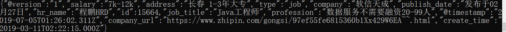
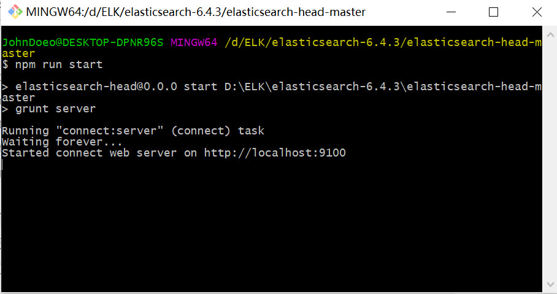
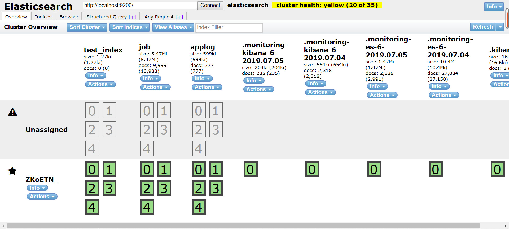
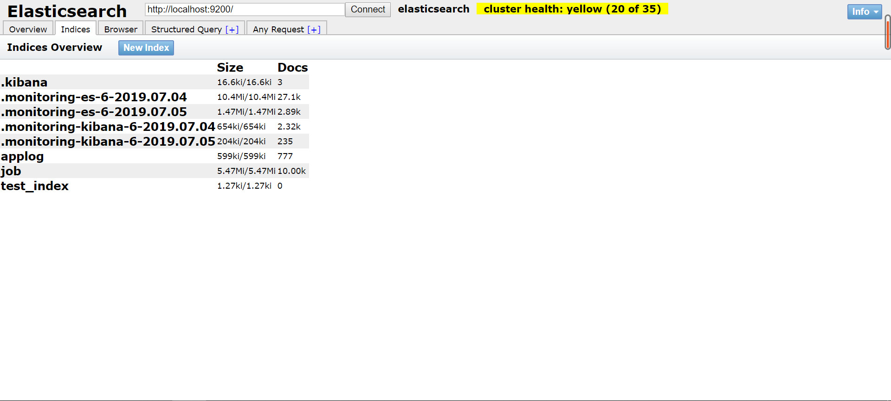

上一篇已经实现了springboot和es的简单整合，基本可以通过springboot来查询es中的数据了，接下来就要实现把mysql中的数据同步到es中，方便进行数据查询
同步数据又几种方法，我这里使用logstash进行数据同步
**1. 首先到官网下载logstash**
下载地址在[这里](https://blog.csdn.net/qq_40930491/article/details/94586862)可以找到
我这里使用的同一版本为6.4.3的
**2.进入${LOGSTASH_HOME}\config**
新建jdbc.conf文件，内容如下：

```
input {
  stdin {}
  jdbc {
  #mysql的jdbc连接工具jar包
    jdbc_driver_library => "C:\Users\JohnDoeo\.m2\repository\mysql\mysql-connector-java\6.0.6\mysql-connector-java-6.0.6.jar"
    #jdbc驱动类全类名
    jdbc_driver_class => "com.mysql.jdbc.Driver"
    #jdbc连接url
    jdbc_connection_string => "jdbc:mysql://localhost:3306/test?useUnicode=true&characterEncoding=UTF-8&useJDBCCompliantTimezoneShift=true&useLegacyDatetimeCode=false&serverTimezone=UTC"
    #数据库用户名
    jdbc_user => "yourusername"
    #数据库密码
    jdbc_password => "yourpassword"
    #数据同步时间及那个（都是*则每一分钟同步一次）
    schedule => "* * * * *"
    #jdbc分页查询开启
    jdbc_paging_enabled => "true"
    #查询每页显示数据条数
    jdbc_page_size => "50000"
    #sql文件路径（就是需要同步的数据）
    statement_filepath => "D:/ELK/logstash-6.4.3/config/jdbc.sql"
    #上次更新位置标记文件路径
    last_run_metadata_path => "D:/ELK/logstash-6.4.3/config/test-config/jobLastInfo.txt"
    #每次启动是否清除上一项配置文件中数据
	clean_run => "false"
    #开启所有字段名转成小写
	lowercase_column_names => "true"
	#解决中文乱码问题
	codec => plain { charset => "UTF-8"}
    type => "job"
  }
}

filter {
    json {
        source => "message"
        remove_field => ["message"]
    }
}

output {
    elasticsearch {
        index => "job"
        document_type => "%{type}"
        #es服务器
        hosts => "localhost:9200"
        document_id => "%{id}"
    }
    stdout {
        codec => json_lines
    }
}
```
接下来在相同目录下创建jdbc.sql文件，内容如下：

```
select * from job
```
这里如果希望进行增量同步的话就要在jdbc.conf中添加相关配置如下

```
 jdbc {
  #mysql的jdbc连接工具jar包
    jdbc_driver_library => "C:\Users\JohnDoeo\.m2\repository\mysql\mysql-connector-java\6.0.6\mysql-connector-java-6.0.6.jar"
    #jdbc驱动类全类名
    jdbc_driver_class => "com.mysql.jdbc.Driver"
    #jdbc连接url
    jdbc_connection_string => "jdbc:mysql://localhost:3306/test?useUnicode=true&characterEncoding=UTF-8&useJDBCCompliantTimezoneShift=true&useLegacyDatetimeCode=false&serverTimezone=UTC"
    #数据库用户名
    jdbc_user => "yourusername"
    #数据库密码
    jdbc_password => "yourpassword"
    #数据同步时间及那个（都是*则每一分钟同步一次）
    schedule => "* * * * *"
    #jdbc分页查询开启
    jdbc_paging_enabled => "true"
    #查询每页显示数据条数
    jdbc_page_size => "50000"
    #sql文件路径（就是需要同步的数据）
    statement_filepath => "D:/ELK/logstash-6.4.3/config/jdbc.sql"
    #上次更新位置标记文件路径
    last_run_metadata_path => "D:/ELK/logstash-6.4.3/config/test-config/jobLastInfo.txt"
    #每次启动是否清除上一项配置文件中数据
	clean_run => "false"
    #开启所有字段名转成小写
	lowercase_column_names => "true"
	#解决中文乱码问题
	codec => plain { charset => "UTF-8"}
	#是否记录上次运行的记录
	record_last_run => "true"
	#是否使用其他字段判断进行数据库同步
	use_column_value => "true"
	#数据库中的增量指标字段名
	tracking_column => "last_modify_time"
    type => "job"
  }
```
并且还要修改jdbc.sql文件：

```
select * from job as j where j.last_modify_time > :sql_last_value
```
****注意：这里的last_modify_time就是jdbc.conf中的tracking_column节点对应的mysql数据库字段名，并且数据库中的增量指标字段类型目前只支持两种numeric,timestamp****

由于我这里只是做一个测试，所有这里就只是查询出一个表job中所有的字段进行同步到es中

**3.接下来就可以启动进行测试了**
ok，接下来就可以先启动es，待es 启动完成，启动logstash，启动命令：

```
${LOGSTASH_HOME}\bin\logstash.bat -f ${LOGSTASH_HOME}\config\jdbc.conf
```
稍等就可以看到logstash启动成功的消息，然后dos窗口就会自动输出logstash进行同步数据的提示信息：

如果想直接查看es中的数据可以有两种方法：
（1）使用elasticsearch-head（这种方法需要先安装node.js），可以在[这里](https://github.com/mobz/elasticsearch-head)下载源码，放在es根目录下，然后使用命令行进入elasticsearch-head-master目录下执行命令：

```
npm install
```
安装grunt工具

```
npm install -g grunt-cli
```
修改es-head配置文件${ES_HEAD}\Gruntfile.js
在grunt.initConfig节点下：
`connect: {
			server: {
				options: {
					port: 9100,
					base: '.',
					keepalive: true
				}
			}
		}`
		在options中添加节点hostname: '0.0.0.0',至此es-head插件的配置就配置完成了
		
在启动es-head之前需要修改es的配置文件，允许远程访问es，在${ES_HOME}\config\elasticsearch.yml中添加如下配置：

```
cluster.name: elk6 #集群名字
node.name: "elk-a1" #节点名字
node.master: true #主节点
node.data: true
discovery.zen.ping.unicast.hosts: ["192.168.x.x"]
discovery.zen.fd.ping_timeout: 60s
discovery.zen.fd.ping_retries: 5
indices.fielddata.cache.size: 40%
bootstrap.system_call_filter: false
path.data: /xx/elasticsearch #数据目录
path.logs: /var/log/elasticsearch #日志目录
network.host: 0.0.0.0
http.cors.enabled: true #允许插件
http.cors.allow-origin: "*"
```
最主要的是最后两条配置，这是允许es被跨域访问的配置
安装完需要的依赖包之后就可以直接运行了
可以直接使用浏览器运行es-head下index.html文件也可以使用npm run start运行，

然后访问 http://localhost:9100即可：这就是es-head连接es的页面：

点击indices可以查看当前es中包含的index（相当于mysql中的表）

可以看到es中又8个index，但是以”.“开头的index是系统自带的，剩下的三个才是我们自己创建的index，这里的job就是我们在jdbc.conf中配置的

    output {
        elasticsearch {
            index => "job"
            document_type => "%{type}"
            hosts => "localhost:9200"
            document_id => "%{id}"
        }
        stdout {
            codec => json_lines
        }
    }

中的index节点对应的命名空间
好了，到这里mysql同步到es就可以说是完成了下一步我要实现springboot+ELK实现日志管理。